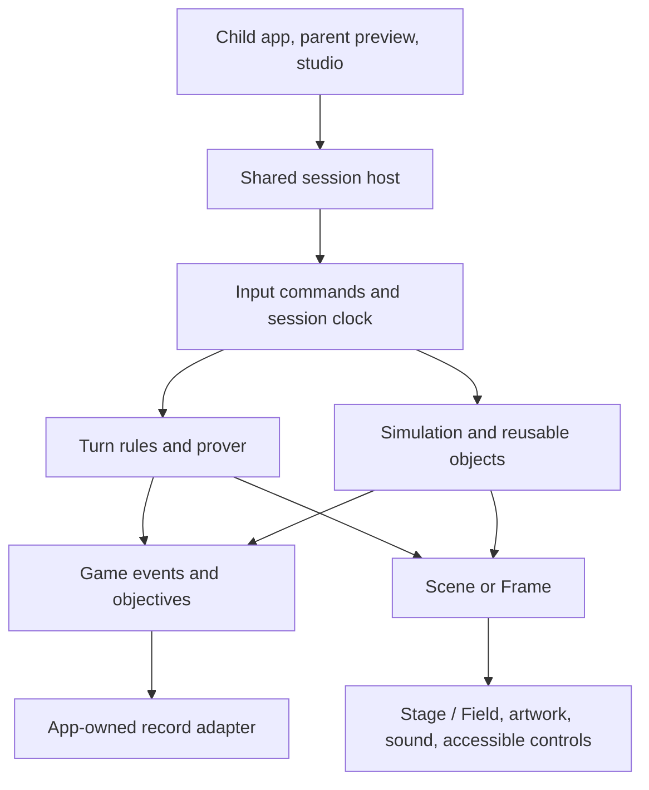

# Internal game engine: direction before migration

Exploration, 23 September 2026. Proposed architecture, not an approved implementation or a claim
that the new capabilities exist. Read games-migration.md for the 17-game inventory. This document
focuses on making future games easier to build and richer to play. The owner has been asked which
direction should lead: physical building, exploration or creative sandboxes. Until that is chosen,
the recommended first proving game is a small physical workshop, based on the existing strengths.

## What we already have

The scratchpad is the host, not the location of most engine code. `play.ts` selects the game;
`play-turn.ts` adapts turn rules to the browser and `play-action.ts` adapts action simulations.

| Layer | Current implementation | Strength and limit |
|---|---|---|
| Domain rules | `school/games/games.ts`, activities, prover | Parameterized turn rules, valid moves, undo and finite-state checking; not a general simulation model |
| Action rules | `school/games/game.ts` and individual games | Common start/step/frame/say/won contract; phases and object behavior are game-specific |
| Controls | `engine/motion/pad.ts`, gestures; `school/games/hands.ts` | Keyboard, touch and gamepad adapters, drags, rails and aims; action Pad is a small fixed vocabulary with one touch/pull |
| Time | `engine/motion/loop.ts` | Fixed steps and a browser/test ticker; not a complete application session lifecycle |
| Simulation | flight, glide, stroke, rail, springs, steering, bodies | Useful independent functions and a Planck adapter; physics API is narrower than the underlying library |
| Presentation | `Scene`, `Frame`, `Sprite`, Stage and Field | Keyed shelf drawings, cameras, layers, transforms, marks, bursts and cached SVG looks |
| Sound | named cues in root; output in scratchpad sound files | Game logic does not depend on audio; browser audio still needs a shared app-owned lifecycle |
| Author tools | tuning tables, proof, traces and runtime statistics | Useful inspection; no shared scene/level construction workflow |
| Records | turn attempt log and event shape | Not yet wired to the child's app; no general checkpoints or saved creations |

The two game models are worth preserving. A jug puzzle can enumerate every move and prove facts
about its graph. Sheep bouncing on rafts are simulated and tested through invariants and controlled
inputs. A common host should support both without pretending a continuous physics state is a finite
turn graph. Hybrid games can combine them: the shunting yard already uses discrete shunt rules
under a physical presentation.

## Concrete pressures in the current source

- Fishing and Rafts each maintain their own phase/state, input interpretation, temporary feedback,
  steps, win time and recovery behavior. Similar concepts recur; their specific rules still differ.
- `ActionGame` has no common pause/resume, checkpoint, restore or dispose contract. Stopping a
  browser runtime is not the same as serializing a game or resuming it safely.
- `Pad` is intentionally compact. A workshop needing selection, rotation, attachment, tool switching
  and multiple simultaneous pointers would otherwise keep adding special meanings to go/brake/touch.
- `Frame` describes how objects look, not what objects are. It has stable drawing keys but no common
  identity for an object carrying a body, interaction targets, attachments and saved state.
- `Happening` carries audiovisual effects: cues, puffs, bursts and shake. A goal being completed or
  cargo being delivered is a separate semantic event, not another particle effect.
- The physics wrapper exposes boxes, circles, ground, sensors, hinges, forces and hit information.
  It does not currently expose a general toolkit of ropes, sliders, motors or compound bodies.
- Physics bodies and random-number closures live inside game state. A plain JSON serialization of
  those state objects cannot serve as a checkpoint. `seeded()` does not expose its current state.
- Tuning knobs are mutable exported objects. Runtime tuning should become session-local before
  concurrent previews or saved replay identity depend on it.
- Field caches SVG looks and avoids unchanged transform writes. It still processes every sprite
  submitted in a frame. Some scenery helpers choose visible objects, but there is no shared whole-
  game visibility/sleep policy. We have not measured a supported maximum scene size.
- Reduced motion can advance many simulation steps synchronously to settle a result. Larger scenes
  need a bounded, cooperative settle path and game-specific alternative controls where appropriate.

## Proposed design

Keep one engine around the existing artwork and game rules. Add a small reusable runtime and
object/interaction layer, then add mechanics only when a real game demonstrates their use.

The engine should not know a family's ID, call the API or decide what counts as learning. The host
provides recording callbacks. Parent preview uses the same game with no child-record callback.

### 1. Session runtime

Own loading, beginning, pausing, restarting, scene changes, completion and disposal in one place.
Hold the simulation tick, input queue, seed/state, immutable level definition and per-session tuning.
Release held input on blur, cancellation, navigation and child switching. Stop audio and effects when
their scene ends. A hidden tab should pause deliberately, not merely receive a clamped frame gap.

Keep discrete and simulated adapters under that lifecycle. Completion should be optional: a creative
sandbox can have meaningful milestones without a terminal win.

Save logical checkpoints at supported boundaries, especially settled construction states. Recreate
physics bodies from saved objects on restore. Mid-flight exact restore is a later requirement with a
larger serialization contract, not an accidental promise of the first checkpoint format.

### 2. Input as intentions

Browser adapters should translate pointers, keys and controllers into game commands such as select,
grab, move, release, rotate, activate, attach, undo and choose-tool. Preserve continuous values where
aim or motion needs them. Keep pointer identity and tick ordering. Adapt current Pad games instead
of rewriting all their controls at once.

Each physical action needs an alternative usable without precise dragging: select a crate and a
destination, adjust an angle in steps, choose an attachment point. The engine can provide these
control patterns, but each game must decide which preserves its challenge and meaning.

### 3. Reusable objects and behaviors

Give objects stable IDs and explicit optional capabilities: transform, drawing, body, selectable
targets, attachment anchors, stored quantities, mover/controller and saved logical state. Reuse
small systems over those capabilities, such as snap-to-anchor, carry/release, follow-a-path,
detect-a-zone and return-to-checkpoint. Keep the first implementation as typed objects and ordinary
functions; a generic entity framework is not needed to prove the design.

A reusable crate definition can combine artwork, mass, collision shape, grip and stacking anchors.
The game supplies whether it represents cargo, a number or a particular delivery. Drawings remain
the source for visual anchors; physical shapes and units are explicit, checked approximations,
not inferred from arbitrary SVG paths.

Only generalize behaviors with demonstrated consumers. Shared flight already serves fishing,
rabbit hops and rafts. A new attachment system should serve both a crane and a construction toy
before it grows a large configuration language.

### 4. Richer interactions and physics

Introduce constraints through the existing bodies wrapper as needed: distance/rope links, sliders,
motors, collision categories and compound shapes. Use analytic motion for predictable paths and
settling effects; reserve rigid-body simulation for interactions where collisions matter.

Water is a good example of defining scope correctly. The current flow helper transfers quantities;
it is not a fluid solver. A garden-pipe puzzle could use a conserved-volume network with visible
streams. A freely sloshing liquid would be a different project and is not required for that game.

Add multi-part animation by anchoring existing drawings to one another: wheels to axles, a hook
to a cable, a gate to a pivot. Preserve stable object IDs across those render pieces.

### 5. Objectives and consequences

Add typed semantic events and composable objective state: delivered an object, matched a quantity,
held a balance for a period, reached a place, completed a sequence. Provide ordered steps and
all/any combinations, with visible progress in the world and clear textual descriptions.

Keep success rules in school/games. The engine supplies the event plumbing and state machinery;
the game decides what a valid cargo delivery means. Distinguish objective state, presentation cues,
and the bounded summary sent to a child's record. Recoverable misses and checkpoints should be
ordinary game behavior rather than bespoke restart logic every time.

### 6. Build / test / revise

For construction games, keep an authored initial scene, the child's editable construction and the
running simulation separate. Edits become commands with undo/redo. Test constructs a fresh runtime
from that design; reset returns to the child's design, not an empty screen. Save the construction
with its schema, asset and rules versions.

Level definitions should declare available parts, quantities, scene placement, objectives and
allowed controls. Begin with checked TypeScript data and a small trusted inspector. Consider a
visual editor or notation extension once two games demonstrate which concepts are shared. Avoid
making authors write loops and collision code for every level, but keep new mechanics in code.

### 7. Presentation and performance

Retain Stage/Field and the shelf as the first renderer. Improve composition, camera framing,
layered scenery, articulation and responsive effects using that existing style.

Measure representative scenes on a target tablet before setting supported object budgets. Suggested
benchmark fixtures are 50/150/300 visible drawing instances and 10/30/60 active physics bodies;
these are test loads, not claims that those counts run well. Record frame-time distribution, input
latency, draw cost, node counts, memory after repeated rounds and resume behavior.

First address visibility filtering, sleeping objects, static scenery, bounded effects and required-
asset loading. If measurements show SVG/DOM is the limit for a desired scene, prototype a second
rendering backend behind Frame while preserving DOM controls and textual state. An engine-wide
renderer replacement should follow evidence, not be a prerequisite for a nicer game.

## Three games that would prove the architecture

| Proposed game | What the child does | Existing foundations | New reusable capability |
|---|---|---|---|
| Harbour cargo workshop | Move crates with a crane, load a boat, balance the load and make deliveries | Shunting rules, drag/rail controls, physics, existing harbour art | Attachments, lifting control, reusable cargo, staged objectives and checkpoint |
| Marble workshop | Arrange ramps, gates and seesaws; release a ball; change the machine until it reaches a target | Slingshot bodies, levers, flight, shelf rods and balls | Editable scene, build/test reset, undo, saved construction and sensors |
| Island expedition | Follow routes, collect tools and solve small mechanisms that open new areas | Map artwork, cameras, steering, game puzzles | Scene transitions, inventory, local navigation, interaction prompts and checkpoints |

These are proposed experiences, not existing complete games or promises that all artwork is present.
Begin with a small cargo scene if no genre preference is chosen. Make the second prototype use the
same object, input, objective and save interfaces. That is the evidence that we built reusable
machinery rather than another one-off. A compact subset is enough: one crane and two deliveries,
then a small ramp-and-gate construction, rather than three large games at once.

## Work order and boundaries

1. Agree the first experience and a short playable specification: controls, challenge, recovery,
   device target and what can be saved. Measure one current action game as a baseline.
2. Extract a shared session/input host using one current turn game and one current action game.
   Preserve existing behavior and prove cleanup, pause, keyboard/touch and reduced-motion paths.
3. Build the small cargo prototype, adding only its needed object/constraint/objective capabilities.
4. Build the construction prototype, extracting proven common behavior and adding logical saves.
5. Put both behind the real app's session and preview adapters; bring the existing catalogue across
   incrementally. Broaden to exploration after its navigation and story requirements are chosen.

Generic simulation functions stay in engine/motion, browser adapters in engine/ui, and rules,
objectives and level content in school/games. If the generic session and object runtime needs its own
engine module, propose that addition explicitly in structure.md and boundaries.ts when implementing.
The proposed architecture does not silently authorize a new directory or change existing imports.

Do not make all current games adopt every new capability. Adapt the old start/step/frame contract
to the new host, and migrate individual games when the new capability helps. Keep authored rules
and deterministic tests. Physics replay requires a pinned rules/engine version and explicit restore
support; seeded inputs alone are not a guarantee of identical results across devices or versions.

## Validation performed

Read the prototype host/runtimes and representative fishing, rafts and shunting game state, the
motion and physics contracts, rendering/cache code, tuning and input model. Ran:

`node --import ./tools/scripts/resolve.ts --test engine/motion/__tests__/*.test.ts school/games/__tests__/*.test.ts`

**262 tests passed, none failed or skipped.** No new runtime was implemented and no performance
claim about large scenes was measured. This is the architecture exploration before migration.
