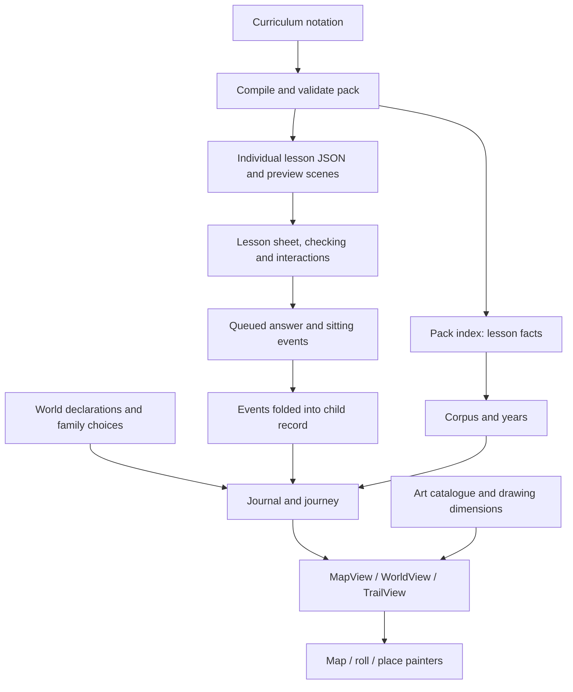

# Maps, worlds and lessons: implementation review

Reviewed 22 September 2026. This describes executable code at review time, with special attention to
loading and responsiveness. It is an architecture review, not a measured browser performance report.
The follow-up loading changes are now implemented in the shared loading seams; the remaining items
below are future work unless marked otherwise.

## The model

The curriculum, a world's identity, a child's progress, and the rendered page are separate things.



The index can describe the whole school without downloading every lesson. A world themes the space
around the lesson; it does not rewrite the lesson or recolour its squared paper. The same lesson can
appear in a term's year and in a subject place without becoming a second piece of curriculum.

The repository currently contains 38 declared worlds, 336 lesson notation files and 2,258 item
notation files. `refsOf(WORLDS.map(w => w.id))` produces 210 unique drawing references, including
36 map-wide references. These are source/dependency counts, not network request or payload counts.

## Curriculum and lesson files

- `tools/pack.ts` reads `content/curriculum`, constructs the notation workspace, rejects compilation
  errors, compiles lessons and validates the result with the runtime pack reader.
- `engine/pack.ts` defines and checks the wire format. A lesson includes its metadata and levels;
  each level contains sections, prose, scenes, questions, answers, hints and feedback rules.
  Practice blocks also carry alternative draws for later use. Medium is required; easy and hard
  are optional.
- `packOf` writes one JSON file per lesson and a separate first-scene file for previews. Filenames
  include a content hash; the index's SHA-256 identifies the whole pack.
- Index facts include title, grade, subject, source ordering, unit, skills, art references, level
  hashes and file paths. Question bodies stay in the individual lesson file.
- `server/pack.ts` validates the index and allows only files it names. It caches file text in memory
  after the first synchronous filesystem read. Pack changes are watched with a 250 ms debounce;
  an unreadable replacement leaves the previous pack running.
- Parent and kid API readers validate JSON at the boundary. Their routes have separate session
  checks. The child's record is folded on the server, avoiding shipping the whole event log for
  the opening map; per-lesson events are fetched for resumes and past sheets.

`school/year.ts` orders each grade by subject, maths first, then unit and source filename. Maths is
the main path; other subjects are distributed as branches along it. Three maths units form a term.
`school/worlds/lessons.ts` builds a memoized corpus of years and lesson topics from the index.
Topics such as `art:clock`, `skill:money` and `subject:physics` connect lessons to world landmarks.

## Every world category

| Category | Worlds and placement |
| --- | --- |
| Grade 1 | Meadow, harbour, railway |
| Grade 2 | Woods, kitchen, town |
| Grade 3 | Night sky, sports ground, laboratory |
| Grade 4 | Mountains, open sea, volcano island |
| Outside the main run | Garden at grade 0; canal town, observatory and old city at grade 5 |
| Family alternatives | Winter fair for term 2 of grades 1–3; valley farm for grade 1 term 1 or grade 2 term 3 |
| Subject places | Marsh, park, old tower, ferry town, painter's hut |
| Further subject places | Coral reef, crystal caves, cloud islands, oasis, fossil cliffs, long grass, lamp rocks, printing works, book island, treetops, salt flats, geyser valley, post office, windmill island, clockwork island |

`school/worlds/worlds.ts` is the registry. Each declaration provides its horizon, gate, sky,
ground, path, landmarks, creatures, guide, weather, chapter moments, map placement, lesson reaches,
allowed customization and explicit missing-content/art descriptions. A track place selects lessons
by subject and/or an explicit list of lesson IDs. A subject world has one shared map location. Its record remains grade-specific; the child reads
their current grade there, while the grown-up can read its full collection.

The garden and fifth-year worlds explicitly describe missing curriculum. An empty place remains an
empty place; its existence does not establish that its lessons are written. The `needs` and `wants`
strings are authored descriptions, not an automatically current inventory.

`choice.ts` validates saved choices and applies allowed tweaks. Reduced motion overrides a family's
motion choice. `school/family/chosen.ts` folds `world-chosen` events against each term's first
`sitting-began`: started terms keep their world and relevant historical tweaks. Parent plan controls
offer eligible unstarted alternatives, rather than moving work already done to another world.

## Progress, rewards and navigation

`school/worlds/rewards.ts` derives the journey from finished lessons and their dates. There is no
separate mutable rewards database. The first finished lesson stamps a world; matching lesson topics
light landmarks or bring followers. Completing the required enabled tracks produces its moment.
The fold preserves earned moments and marks when track settings later change. Roads and the
end-of-year sailing transition also come from progress.

`journalOf` selects a live year, a written-world visit or a hosted track year. `daysOf` groups work
into days; `layoutRoll` arranges those days around measured sheet heights. `layoutTrail` provides
the more compact place view, with stable day slots. `worldViewOf` combines layout, art and progress.

`mapViewOf` builds a journey, positions nodes and roads through `overworld.ts`, creates terrain and
colour reach through `terrain.ts`, and supplies pictures, labels, motion and permissions. Geometry
and geography are local code/data, not fetched map tiles. `engine/space.ts` is the view contract
between the school model and UI.

The current kid map shows eight geographic regions and the other main worlds in pencil, closed
to entry. Its initial frame stays near its current year; shared subject locations show its own
grade's progress. The camera can explore the whole atlas and zoom out to every region. Some earlier comments still describe an own-land-only map or blank paper beyond
the next world; current `mapViewOf`, `Overworld` and world tests supersede those descriptions.

The parent `/map` is the school as written, with no child's record. Every place is open, no child
stands on it, and notes describe its lessons. Opening a normal term world gives its year's roll,
arriving at that term; a subject world gives its hosted track. Written days are numbered, with
answers and parent notes shown, and no earned rewards. The written view reuses completed-day
geometry but removes completion meaning. It currently has no place/trail view.

Parent map addresses preserve world and lesson selection. Overlays use hash navigation and focus
restoration. The kid route instead uses local map/world/place screen state and transfers screen
rectangles between cameras to make entering and leaving look continuous. Subject-place entry
carries the selected world through the roll and place screens. Its hosted journal uses the child's own year, completed work, and only the hosted lessons on their current
plan. Returning to the map preserves the selected place while it remains open. Locked places use
the shared map's explanatory card.

## Kid opening: exact loading order

```text
Entry/session screen + fonts
  -> lazy ChildMap
       |-> start importing the world/roll UI on mount
       |-> record request + pack/index request concurrently
            -> build corpus and family choice
            -> import drawings loader and catalogue
            -> load all requested world/map drawings concurrently
            -> build Loaded model
            -> fetch today's lesson files concurrently
            -> publish Loaded
                 |-> compute MapView and mount Overworld
                 |    -> dynamically import map painter
                 |    -> base geometry, then nearby pieces in short tasks
                 |    -> onDrawn
                 |-> warm lesson UI, pack reader, roll UI and scene renderer
                      -> after onDrawn, prepare today's sheets
```

Important source files: `apps/kids/main.tsx`, `child.tsx`, `views.ts`, `lesson.tsx` and `inside.tsx`.

`loadChild` requests artwork for chosen terms across corpus grades plus side places. `refsOf` also
includes alternate offered landmarks/creatures, chapter art, reach art and map-wide life/furniture.
Thus this is a broad dependency preload, not just art in the first camera frame. Drawing sizes
are obtained by running each loaded drawing's `box` function, which is why loading precedes layout.

Today's JSON is fetched **after** those art imports and **before** the map is published. This is a
real serial dependency in the current implementation, although lesson data and world art could be
prepared concurrently. Fetch failures are omitted from the lesson list; sheet preparation may
attempt missing lessons again.

Once the first nearby map frame is painted, sheet preparation loads scene code, lesson UI and
lesson data together. It then loads scene artwork and any unfinished-sitting state together.
`resumesFor` requests state only for matching unfinished lesson hashes.

`todaysSheets` renders into an offscreen measuring layer, reads height and resume position, then
detaches the sheet element for reuse. The resulting actual elements and interactive state move into
the roll. Width changes recreate sheets. Merely warming/rendering a sheet does not start a sitting.

When entering a world, the code waits for the roll module and for sheets, allowing at most 2.5 s
for the sheet wait. That cap does **not** bound the roll import or subsequent lazy `Inside` import.
It is therefore not an overall click-to-lesson guarantee. `Inside` itself is not preloaded by the
background warming effect, even though the roll and lesson modules are.

## Parent opening and nearby lesson loading

```text
Lazy map route
  -> pack/index request (pack reader import in parallel)
  -> schoolOf
       -> load all 210 world/map drawing references
       -> build written-school MapView
  -> mount Overworld and import painter
  -> paint visible/nearby pieces

Enter world or direct lesson link
  -> lazy Reading
  -> build roll from index facts and placeholder heights
  -> after camera arrival, identify nearby sheets at reading zoom
  -> for each: lesson JSON + lesson UI + scene module concurrently
  -> scene dependencies
  -> draw, measure and insert sheet
```

`apps/home/school.ts:lessonOf` coalesces in-flight reads by pack digest and lesson ID and keeps
successful results. Reported API failures remove the cache entry so a later call can retry.
`schoolOnce` caches school construction for overlay callers; the main map calls `schoolOf` directly.
Even a direct lesson link currently builds the complete school model and loads its world art first.

`engine/ui/reading.tsx` uses `nearPaper`. It retains rendered sheets only near the camera, retains
their heights after disposal, and retains lightweight card elements separately. Existing card hosts
remain stable when paper arrives. Preview pictures use the independent first-scene JSON and a
near-viewport observer. A narrow/wide breakpoint change clears measured paper.

`nearPaper` starts each requested sheet concurrently and deduplicates active requests. It rejects
late results when the sheet is no longer wanted or the generation was forgotten. Its render
notification waits for the whole requested batch's `Promise.all`, so the slowest sibling can delay
displaying otherwise completed sheets. There is no centralized concurrency or priority scheduler.

## What makes the map responsive

The art is primarily dynamically imported drawing code and SVG geometry, including imported
hand-drawn sources. This is not a raster map with a conventional image-tile download queue.

| Mechanism | Current behavior |
| --- | --- |
| Dynamic chunks | Routes, map/scenery painters, lesson UI, scene renderer and individual catalogue drawings load separately |
| Drawing reuse | Module-scoped promise map coalesces drawing loads; loaded drawings remain available for later screens |
| Nearby painting | Map and roll intersect pending piece rectangles with the camera's padded visible region |
| Work budget | Piece loops yield after roughly 10 ms via zero-delay timers; a single expensive piece can exceed this |
| Lookahead | Map uses at least 600 px or a screen width of padding; roll painting uses at least 700 px or viewport height |
| Detail by zoom | Map pieces can specify `minZ`; zoomed-out terrain does not draw all fine detail |
| Sheet lookahead | Settled roll asks for past/reading sheets with twice `max(viewport height, 700)` padding |
| Camera protection | Past sheets wait until arrival is over, camera is not flying and zoom is not far away |
| Stable layout | Real sheet heights replace estimates and remain known after sheet disposal; camera-aware redraw avoids replacing the roll mid-flight |
| Motion | CSS transform keyframes, offscreen/hidden-tab pauses, reduced motion and idle settling reduce ongoing work |
| CSS updates | Roll zoom variables are written to consuming layers/covers, reducing inherited restyles across the entire roll |
| Fonts | Initial font loads run together with a 1.2 s cap; build-generated pages preload the expected faces |

`Overworld.onDrawn` means the initial eligible nearby pieces are complete, not that the entire
country has been painted. More pieces are created while panning/zooming. Painted map pieces are
marked done and remain in the DOM until rebuild; offscreen animation pauses do not evict them.
The lesson paper has stronger disposal than the map scenery.

The optional `steps` prop yields between base terrain and place construction. Main kid and parent
map callers do not pass it. Their later detail loops still yield. Optional travelling backdrop life
starts at idle, but the first-frame sheet work is not generally scheduled through an idle budget.

Parallel promises overlap network/import waits. Layout, parsing, SVG construction and offscreen
sheet measurement still run on the main thread. Background preparation is not worker execution.

## Caches, persistence and recovery

| Layer | Scope and lifetime |
| --- | --- |
| Built JS/CSS assets | Server serves hashed assets with public, year-long immutable caching |
| Lesson/preview files | Authenticated API serves private, year-long immutable caching at digest-qualified URLs |
| Pack index and records | Normal API no-store responses; no persistent full child record cache in this flow |
| Server pack text | In-memory text cache per loaded pack |
| Drawing promises/objects | In-memory module maps, shared across views in that document, with no eviction |
| Corpus years/topics | Memoized within the corpus/model |
| Parent lesson reads | Promise cache keyed by pack and lesson |
| Today's kid lessons | `Loaded.lessons`, explicitly populated during initial load and reload |
| Kid past lessons/events | `Inside` read cache, separate from its rendered paper cache |
| Parent paper | Near-window elements and retained height records |
| Unsent kid work | IndexedDB outbox, with memory fallback if unavailable |

The outbox is not an offline content database. It batches events per kid, resends safely by event
ID and removes acknowledged writes. A finished sheet triggers record refresh only after pending
work has been sent; refresh requests are coalesced. Offline refresh can remain waiting for sync.
Already loaded lessons can survive a connection gap in the current page, but a fresh offline
session is not guaranteed by this architecture.

`onDemand` attempts one page reload per pathname/session-storage marker after a wrapped import
fails. It does not distinguish a missing deployed chunk from other import errors. Not all dynamic
imports use the wrapper. API transport catches offline failures but has no request abort signal or
explicit timeout in `wire.call`.

## Gaps and priorities supported by the code

These are review findings or opportunities, not measured estimates of milliseconds saved.

1. **Shorten the kid's initial dependency chain. Implemented.** Today's lesson reads now start beside
   the broad world-art import using a dimension placeholder, then the real shelf is installed before
   the map model is published. The sheet gate before opening the roll remains intact.
2. **Separate layout dimensions from executable art.** Both maps await a broad art set because
   layout asks loaded drawings for dimensions. A validated dimension manifest or conservative
   layout metadata could allow first-frame art first, adjacent art next, distant art later. Merely
   deleting preload refs would cause missing drawings or zero-size geometry today.
3. **Prioritize rendering as well as fetching.** Add measured scheduling for visible sheets,
   next likely navigation and distant art. Current `Promise.all` fan-out has no priority or bounded
   queue, and synchronous sheet rendering/measurement can occupy a long task after the map appears.
4. **Complete transition warming. Partly implemented.** The kid route now warms `Inside`, the lesson
   renderer, pack readers, scene renderer and roll code on mount, sharing the `Inside` promise with its
   lazy component. Parent direct lesson links and selected-world reading dependencies can still be
   warmed earlier.
5. **Make retries actually recover. Partly implemented.** Drawing-loader failures are removed from
   the shared promise cache, school-build failures are removed from `schoolOnce`, and failed kid lesson
   reads are removed from the per-loaded-model cache. A visible retry control and bounded retry policy
   for nearby paper are still absent. The roll suppresses identical near sets, so retry support inside
   `nearPaper` alone does not provide automatic retry.
6. **Guard kid past-sheet lifetimes. Implemented.** `Inside.lookBack` now uses a generation and wanted
   set across lesson/state/scene awaits, so late work after leaving, resizing or moving away cannot
   repopulate stale paper.
7. **Handle pack replacement coherently.** `packFile` serves only the current digest, despite older
   directories being retained by the pack writer. An already open tab requesting an uncached file
   from its old index gets 404 after replacement. Kid record and index are fetched independently,
   and `loadChild` does not check their pack digests match; `reloadChild` keeps its existing pack.
   Choose retained-digest serving or explicit coordinated pack refresh.
8. **Measure exploration memory.** Drawing caches and parent lesson caches have no bound, painted
   map pieces remain, and card/height caches retain visited entries. Paper disposal helps but does
   not establish a bounded total memory footprint for a long session.
9. **Narrow lesson art preparation where justified.** `scenesIn` scans every level and repeat draw,
   even for a sheet currently showing medium. Also, `scene.ts` statically carries a substantial
   common drawing vocabulary. Loading a scene is not exclusively a set of per-used-part chunks.

Secondary cache detail: `schoolOnce` keys by digest but takes a reduced-motion argument. That
argument is not part of its key, so a subsequent call with a different preference reuses the first
model. `fetchLessons` itself neither memoizes in-flight promises nor populates `Loaded.lessons`;
its callers do the relevant caching.

## Verification and limits

Executed the existing focused tests for worlds, written/sample/trail views, parent world choices,
kid opening, paper lifecycle, drawing dimensions and lesson behavior: **80 passed, 1 failed**.
The failure is `school/__tests__/lessons.test.ts:782`: the test expects `pointOf` to return null
without an authored rule, while current code deliberately falls back to an arranged or drawable
scene part and returns `bus`. No source was changed to produce this mismatch.

Executed `tools/__tests__/first-view.test.ts`: **6 passed**, including a fresh production build,
chunk isolation, font preloads and visitor-pack checks. Current enforced budgets are uncompressed
output bytes: site opening JS 100,000; CSS 30,000; site data 25,000; site map dependency set
1,850,000; kid entry JS 125,000; kid map static dependency set before artwork 380,000; parent entry
JS 95,000. These are ceilings, not measured download totals, and do not bound the full runtime
network waterfall or interaction latency.

Existing map browser tests cover parent map entry, pan/zoom, navigation, written sheets, overlays
and history. They were read but not run in this review. No full repository check, live family-data
exercise, cold-network profile or low-end device benchmark was performed.

Before promising faster UX, measure cold/warm parent and kid entry, direct lesson links, rapid
pan/zoom, entering before sheets are ready, width changes during loads, a connection drop, and a
pack change in an open tab. Record first usable map, first answerable sheet, long tasks, request
waterfalls and retained memory. Keep first-map paint separate from all-content readiness.

## Where to make future changes

| Responsibility | Main files |
| --- | --- |
| Content compilation and wire format | `tools/pack.ts`, `engine/notation/compile.ts`, `engine/pack.ts` |
| Pack serving and record endpoints | `server/pack.ts`, `server/sync.ts`, `server/http.ts` |
| Year ordering and prerequisites | `school/year.ts` |
| World catalogue and customization | `school/worlds/worlds.ts`, individual world declarations, `types.ts`, `choice.ts`, `check.ts` |
| Historical family choices | `school/family/chosen.ts`, `apps/home/worlds.ts` |
| Progress and visual rewards | `school/record/record.ts`, `school/worlds/rewards.ts` |
| Map/roll/place models | `school/worlds/view.ts`, `written.ts`, `overworld.ts`, `terrain.ts`, `roll.ts`, `trail.ts` |
| Art dependencies and loading | `school/worlds/art.ts`, `engine/parts/catalog.ts`, `engine/ui/drawings.ts` |
| Kid orchestration | `apps/kids/child.tsx`, `views.ts`, `inside.tsx`, `lesson.tsx` |
| Parent browsing | `apps/home/map.tsx`, `school.ts`, `engine/ui/reading.tsx`, `overlay.tsx` |
| Painting and camera | `engine/ui/overworld.tsx`, `map.ts`, `world.tsx`, `place.tsx`, `scenery.ts`, `view.ts` |
| Paper and scene rendering | `engine/ui/paper.ts`, `lesson.tsx`, `scene.ts` |
| Checking and queued work | `school/lessons.ts`, `engine/ui/kid.ts` |
| Build limits and regression checks | `vite.config.ts`, `tools/first-view.ts`, `tools/__tests__/first-view.test.ts`, `tools/e2e/map.e2e.ts` |
